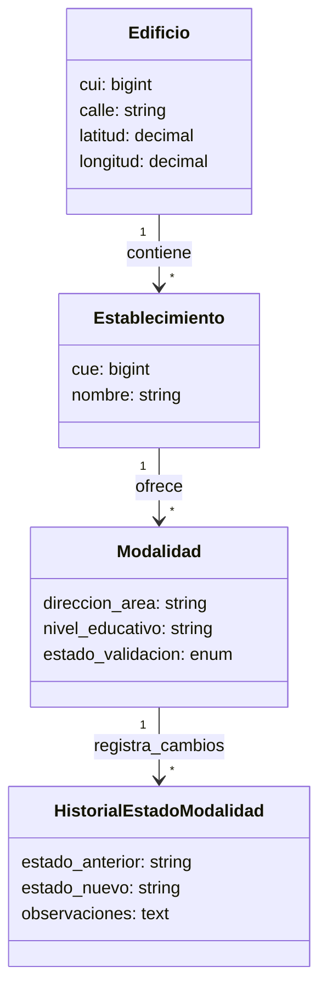

# Arquitectura de la Aplicación (Laravel 12 + React + Inertia.js)

Este documento detalla la arquitectura, estructura de archivos y flujos de datos del proyecto **Establecimientos**.

---

## 🛠️ Stack Tecnológico Real

La plataforma prescinde de complejas APIs públicas o de microservicios, optando por una arquitectura monolítica híbrida de alto rendimiento:

### Backend
*   **Laravel 12.x:** Framework PHP de última generación.
*   **PHP 8.2+:** Entorno de ejecución optimizado.
*   **SQLite:** Base de datos compacta y veloz con indexación de filtros.

### Frontend
*   **React 18+:** Biblioteca declarativa para la construcción de interfaces de usuario interactivas.
*   **Inertia.js 2.x:** El "pegamento" que conecta Laravel y React. Permite crear una Single Page Application (SPA) usando rutas tradicionales de Laravel y controladores que retornan vistas de React directamente.
*   **Tailwind CSS 3.x:** Framework de estilos utilitarios con colores institucionales predefinidos.

### Reportes y Testing
*   **Barryvdh/Laravel-DomPDF:** Motor para la compilación y exportación de informes PDF.
*   **PHPUnit / Pest PHP:** Frameworks de testing integrados para validar flujos críticos.

---

## 📂 Estructura del Proyecto Real

La estructura de directorios sigue estrictamente los estándares de Laravel con un frontend moderno en React:

```
Establecimientos/
├── app/
│   ├── Console/
│   │   └── Commands/
│   │       ├── ImportEstablecimientos.php  # Comando Artisan para importación
│   │       └── ImportZonas.php              # Comando para sincronización de zonas
│   ├── Http/
│   │   ├── Controllers/
│   │   │   ├── Admin/                       # Controladores de Consola Admin (React/Inertia)
│   │   │   │   └── AdminController.php
│   │   │   ├── Administrativos/             # Controladores ABM y Validación (React/Inertia)
│   │   │   │   ├── AuditoriaController.php
│   │   │   │   ├── DashboardController.php
│   │   │   │   ├── EdificioController.php
│   │   │   │   └── ModalidadController.php
│   │   │   ├── Publico/                     # Controladores Públicos y de Mapa
│   │   │   │   ├── MapaController.php
│   │   │   │   └── ReporteController.php
│   │   │   └── Api/                         # Endpoints throttleados de mapa
│   │   │       └── EdificiosMapaController.php
│   │   ├── Middleware/
│   │   │   ├── CheckRole.php                # Middleware de autorización granular
│   │   │   └── HandleInertiaRequests.php    # Middleware de hidratación de estados Inertia
│   │   └── Requests/                        # Validación de formularios
│   ├── Models/
│   │   ├── Edificio.php                     # Inmueble (CUI único)
│   │   ├── Establecimiento.php              # Escuela (CUE único)
│   │   ├── Modalidad.php                    # Oferta educativa y validación (Fila de Excel)
│   │   ├── HistorialEstadoModalidad.php     # Logs detallados de cambio de estado
│   │   ├── AuditoriaEduge.php               # Logs de conciliación con EDÚGE
│   │   ├── Reporte.php                      # Reportes de inconsistencias ciudadanas
│   │   └── User.php                         # Usuarios de plataforma con roles
│   ├── Observers/                           # Observadores de Modelos (e.g. Auditoría)
│   └── Services/                            # Capa de Lógica de Negocio
│       ├── ExcelImportService.php           # Importación y normalización
│       └── AuditoriaQueryService.php        # Queries complejas para auditoría
│
├── bootstrap/
│   └── app.php                              # Registro de middlewares y excepciones
│
├── config/                                  # Archivos de configuración de Laravel
│
├── database/
│   ├── migrations/                          # Definición de tablas relacionales e índices
│   └── seeders/                             # Inicialización de usuarios de prueba
│
├── resources/
│   ├── css/
│   │   └── app.css                          # Directivas y clases personalizadas de Tailwind
│   ├── js/
│   │   ├── app.jsx                          # Punto de entrada de React e Inertia
│   │   ├── Components/                      # Componentes comunes (Botones, Modales, Badges)
│   │   ├── Layouts/                         # Contenedores (AuthenticatedLayout.jsx)
│   │   └── Pages/                           # Páginas React correspondientes a vistas
│   │       ├── Admin/                       # Vistas de Administrador (React)
│   │       ├── Administrativos/             # Vistas ABM y Validación (React)
│   │       ├── Auth/                        # Formularios de Login, Reset y Registro
│   │       └── Publico/                     # Mapa Público y Geolocalización
│   └── views/
│       ├── app.blade.php                    # Layout HTML base para montar la SPA de Inertia
│       └── pdf/                             # Plantillas Blade para renderizar PDF
│
├── routes/
│   ├── web.php                              # Rutas web unificadas con roles
│   └── auth.php                             # Rutas de autenticación Breeze
│
├── tailwind.config.js                       # Configuración de colores de marca y fuentes
└── vite.config.js                           # Compilador de bundles de React
```

---

## 👥 Sistema de Roles y Seguridad

### Roles Soportados:
1.  **`admin`:** Control total, alta de usuarios, purga de papelera y monitoreo general.
2.  **`administrativo`:** Carga de datos, corrección de inmuebles, conciliación EDUGE e informes.
3.  **`user`:** Rol estándar por defecto, de acceso limitado (o redirigido según caso).

### Jerarquía y Protección:
La protección de rutas se define mediante middleware de roles combinando el control de autenticación:

```php
// En routes/web.php:

// Común para Admin y Administrativos
Route::middleware(['auth', 'role:admin,administrativos'])->prefix('administrativos')->group(function () {
    Route::get('/Panel', [DashboardController::class, 'index'])->name('administrativos.dashboard');
    Route::get('/establecimientos', [ModalidadController::class, 'index'])->name('administrativos.establecimientos.index');
});

// Exclusivo para Administradores
Route::middleware(['auth', 'role:admin'])->prefix('admin')->group(function () {
    Route::get('/users', [AdminController::class, 'users'])->name('admin.users.index');
});
```

---

## 🔄 Flujo de Renderizado e Hidratación de Datos (Inertia.js)

Inertia.js elimina la necesidad de crear APIs REST complejas (con JSON y Axios en cada vista). El flujo funciona de la siguiente manera:

```
[Usuario hace clic en Ruta] 
          ↓
[Ruta en web.php captura petición]
          ↓
[Controller carga datos relacionales con Eloquent]
          ↓
[Controller retorna Inertia::render('Folder/Component', [datos])]
          ↓
[Inertia intercepta y actualiza el DOM hidratando el componente React]
```

### Ejemplo de Controlador React/Inertia:
```php
public function index(Request $request): Response
{
    $modalidades = $this->queryService->getFilteredQuery($request)
        ->paginate(10);

    // Retorna directamente el componente React en resources/js/Pages/Administrativos/Auditoria/Index.jsx
    return Inertia::render('Administrativos/Auditoria/Index', [
        'modalidades' => $modalidades,
        'filters' => $request->all(),
    ]);
}
```

---

## 📐 Estructura del Modelo de Relaciones (3 Niveles)

Las tablas relacionales SQLite están mapeadas a través de modelos Eloquent con relaciones óptimas (`with` para evitar consultas N+1):



### Relaciones en Código Eloquent:
*   **Edificio:** `hasMany(Establecimiento::class)`
*   **Establecimiento:** `belongsTo(Edificio::class)`, `hasMany(Modalidad::class)`
*   **Modalidad:** `belongsTo(Establecimiento::class)`, `hasOneThrough(Edificio::class, Establecimiento::class)`, `hasMany(HistorialEstadoModalidad::class)`

---

## 🔒 Consideraciones de Seguridad y Auditoría

1.  **Bitácora:** Toda acción de cambio de estado de validación en una modalidad (`estado_validacion` cambia de `PENDIENTE` a `CORRECTO`/`CORREGIDO`) se escribe automáticamente en `historial_estados_modalidad` capturando el `user_id` del validador y las `observaciones`.
2.  **CSRF & SQL Injection:** Totalmente protegidos por la seguridad nativa del motor de routing y ORM Eloquent de Laravel 12.
3.  **Sanitización de Coordenadas:** Las lat/long importadas del Excel se normalizan en la capa de servicios garantizando que cumplan el formato de punto flotante compatible con los visores del mapa Leaflet.
