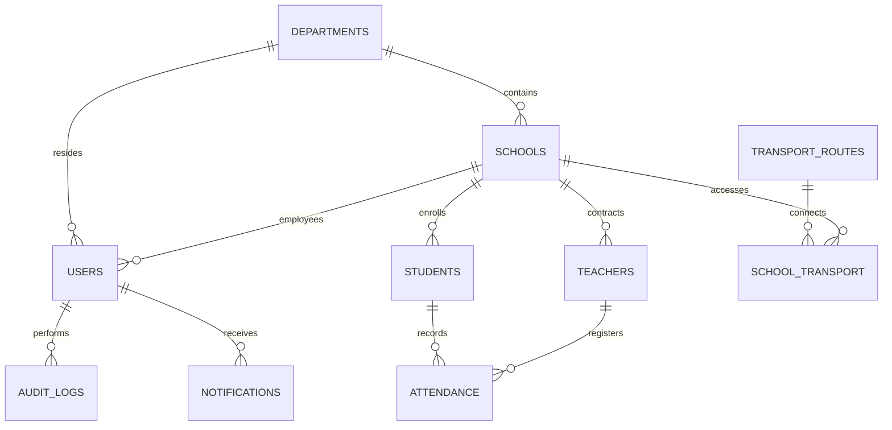

# SUE - Sistema Único Educativo
## Especificación de Arquitectura de Base de Datos y Sistema de Permisos (RBAC)

Este documento detalla la estructura física futura y las relaciones de la base de datos de **SUE (Sistema Único Educativo)** para la Provincia de San Juan. El diseño está concebido para PostgreSQL / Supabase, aprovechando Row-Level Security (RLS) y optimizaciones geoespaciales (PostGIS) para los trazados cartográficos oficiales del IGN/IDERA y redes de transporte (RedTulum).

---

## 1. Arquitectura Tecnológica General

El ecosistema digital integrado de SUE se compone de la siguiente pila tecnológica para asegurar robustez, velocidad de renderizado y seguridad:

*   **Frontend Principal:** Next.js (App Router, React 18+, TailwindCSS, Leaflet interactivo)
*   **Backend de Servicios:** NestJS (Node.js, TypeScript, Arquitectura Modular)
*   **Base de Datos Relacional:** PostgreSQL en Supabase (con extensiones `uuid-ossp`, `PostGIS` para datos geográficos)
*   **Autenticación y Autorización:** JWT con Seguridad basada en Roles (RBAC - Role-Based Access Control) y políticas RLS de Supabase.
*   **Almacenamiento:** Supabase Storage (para legajos digitales, boletines en PDF, certificaciones oficiales).

---

## 2. Diagrama de Relaciones de la Base de Datos (E/R)



---

## 3. Diccionario de Tablas y Esquema Físico (Futuro)

### 3.1. Tabla: `departments`
Almacena las divisiones políticas oficiales (los 19 departamentos de San Juan) y sus límites vectoriales (IGN/IDERA).

| Campo | Tipo | Restricción | Descripción |
| :--- | :--- | :--- | :--- |
| `id` | `BIGINT` | PRIMARY KEY, GENERATED ALWAYS AS IDENTITY | Identificador único del departamento. |
| `name` | `VARCHAR(100)` | UNIQUE, NOT NULL | Nombre oficial (ej. "CAPITAL", "BARREAL"). |
| `geojson` | `JSONB` | NOT NULL | Polígono geográfico oficial en formato GeoJSON. |

### 3.2. Tabla: `schools`
Registra la infraestructura escolar y escuelas activas de la provincia.

| Campo | Tipo | Restricción | Descripción |
| :--- | :--- | :--- | :--- |
| `id` | `UUID` | PRIMARY KEY, DEFAULT gen_random_uuid() | Identificador único del edificio/institución. |
| `name` | `VARCHAR(255)` | NOT NULL | Nombre de la institución educativa. |
| `cue` | `VARCHAR(9)` | UNIQUE, NOT NULL | Código Único de Establecimiento (CUE). |
| `department_id` | `BIGINT` | FOREIGN KEY REFERENCES `departments(id)` | Departamento geográfico al que pertenece. |
| `lat` | `DOUBLE PRECISION` | NOT NULL | Latitud exacta para mapeo. |
| `lng` | `DOUBLE PRECISION` | NOT NULL | Longitud exacta para mapeo. |
| `type` | `VARCHAR(20)` | CHECK (type IN ('PÚBLICO', 'PRIVADO')) | Tipo de gestión administrativa. |
| `level` | `VARCHAR(50)` | NOT NULL | Nivel (Secundario, Inicial, Primario, Técnico). |
| `status` | `VARCHAR(20)` | DEFAULT 'Activa' | Estado de actividad ('Activa', 'En Refacción', 'Inactiva'). |

### 3.3. Tabla: `users`
Almacena los usuarios unificados del ecosistema con sus roles administrativos RBAC.

| Campo | Tipo | Restricción | Descripción |
| :--- | :--- | :--- | :--- |
| `id` | `UUID` | PRIMARY KEY, DEFAULT gen_random_uuid() | ID único de usuario unificado. |
| `name` | `VARCHAR(150)` | NOT NULL | Nombre y apellido completo. |
| `email` | `VARCHAR(150)` | UNIQUE, NOT NULL | Correo electrónico de acceso. |
| `password_hash`| `VARCHAR(255)` | NOT NULL | Contraseña encriptada con bcrypt. |
| `role` | `VARCHAR(20)` | CHECK (role IN ('ADMIN', 'MINISTERIO', 'DIRECTIVO', 'DOCENTE', 'PADRE', 'ALUMNO')) | Rol para el control de acceso (RBAC). |
| `department_id` | `BIGINT` | NULLABLE, FOREIGN KEY `departments(id)` | Departamento si su jurisdicción es regional. |
| `school_id` | `UUID` | NULLABLE, FOREIGN KEY `schools(id)` | Escuela asignada (si es directivo/docente/alumno). |
| `created_at` | `TIMESTAMP` | DEFAULT CURRENT_TIMESTAMP | Fecha de creación del registro. |

### 3.4. Tabla: `teachers`
Contiene la información profesional y laboral de los docentes contratados.

| Campo | Tipo | Restricción | Descripción |
| :--- | :--- | :--- | :--- |
| `id` | `UUID` | PRIMARY KEY, FOREIGN KEY REFERENCES `users(id)` | Enlace directo con el usuario base. |
| `dni` | `VARCHAR(10)` | UNIQUE, NOT NULL | Documento Nacional de Identidad. |
| `name` | `VARCHAR(150)` | NOT NULL | Nombre y Apellido. |
| `school_id` | `UUID` | FOREIGN KEY REFERENCES `schools(id)` | Escuela donde dicta clases principalmente. |
| `position` | `VARCHAR(100)` | NOT NULL | Cargo o materias que dicta (ej: "Matemática"). |
| `status` | `VARCHAR(20)` | DEFAULT 'Activo' | Estado laboral ('Activo', 'Licencia', 'Suplente'). |

### 3.5. Tabla: `students`
Registra la matrícula activa y los perfiles de los estudiantes en San Juan.

| Campo | Tipo | Restricción | Descripción |
| :--- | :--- | :--- | :--- |
| `id` | `UUID` | PRIMARY KEY, FOREIGN KEY REFERENCES `users(id)` | Enlace directo con el usuario del alumno. |
| `dni` | `VARCHAR(10)` | UNIQUE, NOT NULL | Documento Nacional de Identidad. |
| `name` | `VARCHAR(150)` | NOT NULL | Nombre y Apellido. |
| `school_id` | `UUID` | FOREIGN KEY REFERENCES `schools(id)` | Escuela en la cual está inscrito. |
| `parent_id` | `UUID` | FOREIGN KEY REFERENCES `users(id)` | Tutor legal (Padre/Madre/Responsable). |
| `grade` | `VARCHAR(50)` | NOT NULL | Grado o año y división (ej: "4° Año Construcciones"). |
| `status` | `VARCHAR(20)` | DEFAULT 'Regular' | Estado de escolaridad ('Regular', 'Suspendido', 'Egresado'). |

### 3.6. Tabla: `attendance`
Registra el control de asistencia diario aula por aula de forma digital e inmediata.

| Campo | Tipo | Restricción | Descripción |
| :--- | :--- | :--- | :--- |
| `id` | `BIGINT` | PRIMARY KEY, GENERATED ALWAYS AS IDENTITY | Identificador de registro de asistencia. |
| `student_id` | `UUID` | FOREIGN KEY REFERENCES `students(id)` | Estudiante evaluado. |
| `date` | `DATE` | NOT NULL | Fecha de la jornada escolar. |
| `status` | `VARCHAR(20)` | CHECK (status IN ('Presente', 'Ausente', 'Tarde', 'Justificado')) | Estado de asistencia. |
| `teacher_id` | `UUID` | FOREIGN KEY REFERENCES `teachers(id)` | Docente que tomó asistencia. |

### 3.7. Tabla: `notifications`
Gestiona el sistema de alertas tempranas, avisos a padres y notificaciones globales del Ministerio.

| Campo | Tipo | Restricción | Descripción |
| :--- | :--- | :--- | :--- |
| `id` | `UUID` | PRIMARY KEY, DEFAULT gen_random_uuid() | ID único de notificación. |
| `user_id` | `UUID` | FOREIGN KEY REFERENCES `users(id)` | Usuario destino de la notificación. |
| `title` | `VARCHAR(150)` | NOT NULL | Título del aviso (ej: "Alerta de Zonda"). |
| `body` | `TEXT` | NOT NULL | Cuerpo detallado del aviso. |
| `type` | `VARCHAR(20)` | NOT NULL | Categoría ('Alerta', 'Asistencia', 'Administrativo'). |
| `read` | `BOOLEAN` | DEFAULT FALSE | Estado de lectura por el destinatario. |

### 3.8. Tabla: `transport_routes`
Modelado geográfico de la red de transporte provincial (RedTulum).

| Campo | Tipo | Restricción | Descripción |
| :--- | :--- | :--- | :--- |
| `id` | `BIGINT` | PRIMARY KEY, GENERATED ALWAYS AS IDENTITY | ID único de ruta de colectivo. |
| `line_name` | `VARCHAR(100)` | NOT NULL | Nombre de la línea (ej: "RedTulum 401"). |
| `origin` | `VARCHAR(150)` | NOT NULL | Parada de origen. |
| `destination` | `VARCHAR(150)` | NOT NULL | Parada final. |
| `geojson` | `JSONB` | NOT NULL | Trazado vectorial de la línea (LineString). |

### 3.9. Tabla: `school_transport`
Relación de conectividad e infraestructura entre escuelas y transporte público.

| Campo | Tipo | Restricción | Descripción |
| :--- | :--- | :--- | :--- |
| `school_id` | `UUID` | FOREIGN KEY REFERENCES `schools(id)` | Escuela asociada. |
| `route_id` | `BIGINT` | FOREIGN KEY REFERENCES `transport_routes(id)` | Línea de colectivo conectada. |
| `distance` | `DOUBLE PRECISION` | NOT NULL | Distancia en metros desde la parada a la escuela. |
| `estimated_time`| `INTEGER` | NOT NULL | Tiempo de caminata estimado en minutos. |
| PRIMARY KEY | `(school_id, route_id)` | Llave primaria compuesta. |

### 3.10. Tabla: `audit_logs`
Bitácora de seguridad del sistema (compliance gubernamental).

| Campo | Tipo | Restricción | Descripción |
| :--- | :--- | :--- | :--- |
| `id` | `BIGINT` | PRIMARY KEY, GENERATED ALWAYS AS IDENTITY | Registro de auditoría. |
| `user_id` | `UUID` | FOREIGN KEY REFERENCES `users(id)` | Usuario ejecutor de la acción. |
| `action` | `VARCHAR(255)` | NOT NULL | Descripción de la acción (ej: "Firmó autorización"). |
| `timestamp` | `TIMESTAMP` | DEFAULT CURRENT_TIMESTAMP | Fecha y hora exacta del suceso. |

---

## 4. Matriz de Control de Acceso basado en Roles (RBAC)

El sistema valida permisos a nivel de ruta (NestJS Guards) y de base de datos (PostgreSQL RLS). La siguiente matriz detalla las operaciones disponibles para cada rol:

| Módulo / Recurso | ADMIN | MINISTERIO | DIRECTIVO | DOCENTE | PADRE | ALUMNO |
| :--- | :---: | :---: | :---: | :---: | :---: | :---: |
| **Auditoría General (`audit_logs`)** | `CRUD` | `R` | - | - | - | - |
| **Alertas Climáticas/Gobernanza** | `CRUD` | `CRUD` | `R` | `R` | `R` | `R` |
| **Geometría Mapas e Infraestructura**| `CRUD` | `CRUD` | `R` | `R` | `R` | `R` |
| **Gestión RRHH y Suplencias** | `CRUD` | `CRUD` | `CRUD` | - | - | - |
| **Planificaciones de Clases con IA** | `CRUD` | `R` | `R` | `CRUD` | - | - |
| **Toma de Asistencia Diaria** | `CRUD` | `R` | `R` | `CRUD` | - | - |
| **Firmas / Autorizaciones Digitales**| `CRUD` | - | `CRUD` | `R` | `CRUD` | - |
| **Tutorías de Aprendizaje IA** | `CRUD` | - | - | `R` | `R` | `CRUD` |
| **Ver Boletín e Insignias** | `CRUD` | `R` | `R` | `R` | `R` | `R` |

*Leyenda: `C` = Crear, `R` = Leer, `U` = Actualizar, `D` = Eliminar, `-` = Sin acceso.*

---

## 5. Índices de Rendimiento Recomendados (PostgreSQL)

Para optimizar las búsquedas de autocompletado y cruces geográficos:
```sql
-- Índice para búsqueda de CUE en escuelas
CREATE INDEX idx_schools_cue ON schools(cue);

-- Índice compuesto para auditorías cronológicas
CREATE INDEX idx_audit_logs_user_timestamp ON audit_logs(user_id, timestamp DESC);

-- Índice GIST para consultas cartográficas aceleradas
CREATE INDEX idx_schools_geo ON schools USING gist(ll_to_earth(lat, lng));
```
